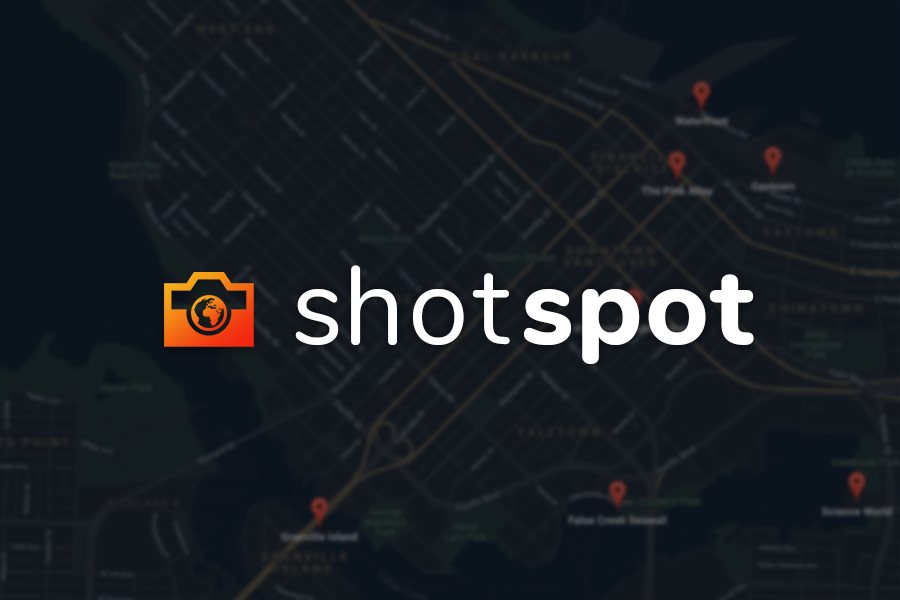

  

# Inspiration

How often have you found yourself in a new city, hoping to take that beautiful shot for Instagram or LinkedIn? Wouldn't it be awesome if there was an app that could tell you the best photography spots without the hassle of searching for individual locations yourself? That's what inspired us to create ShotSpot, an easy to use web app that displays the locations of top Instagram posts for any city in the world on a user-friendly map navigation system.

# What it does

You can either begin by entering your desired location or by automatically detecting your current location through our pinpoint feature. The app will then display markers that lead you to all of the best photography spots in the area. If you find a great spot and want to share it with the photography community, the app also allows you to add your own spot to the map.

# How we built it

For the backend, we created a Python script that routinely scrapes Instagram locations for top photos. To get the latitude/longitude, thumbnail image, and post id, we used BeautifulSoup for scraping and outputted the results to JSON files, which are uploaded via boto3 to AWS S3.

The frontend is configured using Node.js / Express to serve the web app to the user. When a request is made to a location, Express reads the corresponding .json files from AWS S3 and sends the information using socket.io to the frontend, which is then displayed using the Google Maps API.

# Challenges we ran into

First of all, gathering data from Instagram turned out to be a significant challenge, especially since it was our first time web scraping. At first, we had to tediously hardcode latitude, longitude, and urls for the top posts of every location. That proved to be an unfeasible challenge — and so we modified our Python script to automate this process.

We also didn't have much experience working with the Google Maps API, so figuring how to get markers to display and the location search autocomplete to work took a while. It was also our first time using socket.io, and we learned a lot in regard to client/server communication. Deploying the app was also a big pain because of Heroku's ephemeral filesystem - you can't write to files locally so we had to set up a pipeline to upload the .json files to an AWS S3 bucket.

# Accomplishments that we're proud of

Firstly, we are extremely proud of our final product! It is especially fulfilling to have created a functioning application that is not reliant on hardcoded data. We are also proud of how we picked up on many new skills over the course of this project, from web scraping libraries to node.js. Most importantly, we are proud of how well we worked together as a team. It's a weekend we'll remember! <3

# What we learned

- How to use Google Maps and Places API
- How to use node.js for backend development
- How to scrape websites like Instagram for hidden data (and how frustrating it can be to scrap websites like Instagram for hidden data)
- Learning about how to read and write to .json files
- How to use AWS S3 and read/write to it programatically
- Deploying a web app to a domain for users around the world to access

# What's next for ShotSpot

**Worldwide rollout!** We want the app to work worldwide as currently it only works in a few select locations. Furthermore, we want to incorporate a tool that allows nearby photographers to connect with local content creators. This will further encourage the inclusivity that we highly value.
